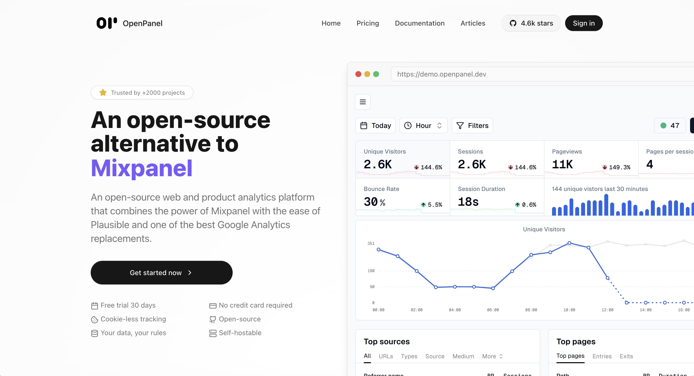

<p align="center">
	<h1 align="center"><b>Openpanel</b></h1>
<p align="center">
    An open-source alternative to Mixpanel
    <br />
    <br />
    <a href="https://openpanel.dev">Website</a>
    ·
    <a href="https://openpanel.dev/docs">Docs</a>
    ·
    <a href="https://dashboard.openpanel.dev">Sign in</a>
    ·
    <a href="https://go.openpanel.dev/discord">Discord</a>
    ·
    <a href="https://twitter.com/OpenPanelDev">X/Twitter</a>
    ·
    <a href="https://twitter.com/CarlLindesvard">Creator</a>
    ·
  </p>
  <br />
  <br />
</p>
  
Openpanel is a powerful analytics platform that captures and visualizes user behavior across web, mobile apps, and backend services. It combines the power of Mixpanel with the simplicity of Plausible.

## Disclaimer

> Hey folks 👋🏻 Just a friendly heads-up: we're still in the early stages of this project. We have migrated from pages to app dir and made some major changes during the development of Openpanel, so everything is not perfect.

## Stack

- **Nextjs** - the dashboard
- **Fastify** - event api
- **Postgres** - storing basic information
- **Clickhouse** - storing events
- **Redis** - cache layer, pub/sub and queue
- **BullMQ** - queue
- **Resend** - email
- **Arctic** - oauth
- **Oslo** - auth
- **tRPC** - api
- **Tailwind** - styling
- **Shadcn** - ui

## Self-hosting

OpenPanel can be self-hosted and we have tried to make it as simple as possible.

You can find the how to [here](https://openpanel.dev/docs/self-hosting/self-hosting)

**Give us a star if you like it!**

[](https://star-history.com/#Openpanel-dev/openpanel&Date)

## Development

### Prerequisites

- Docker
- Docker Compose
- Node
- pnpm

### Setup

Add the following to your hosts file (`/etc/hosts` on mac/linux or `C:\Windows\System32\drivers\etc\hosts` on windows). This will be your local domain.

```
127.0.0.1 op.local
127.0.0.1 api.op.local
```

### Start

```bash
pnpm dock:up
pnpm codegen
pnpm migrate:deploy # once to setup the db
pnpm dev
```

You can now access the following:

- Dashboard: https://op.local
- API: https://api.op.local
- Bullboard (queue): http://localhost:9999
- `pnpm dock:ch` to access clickhouse terminal
- `pnpm dock:redis` to access redis terminal