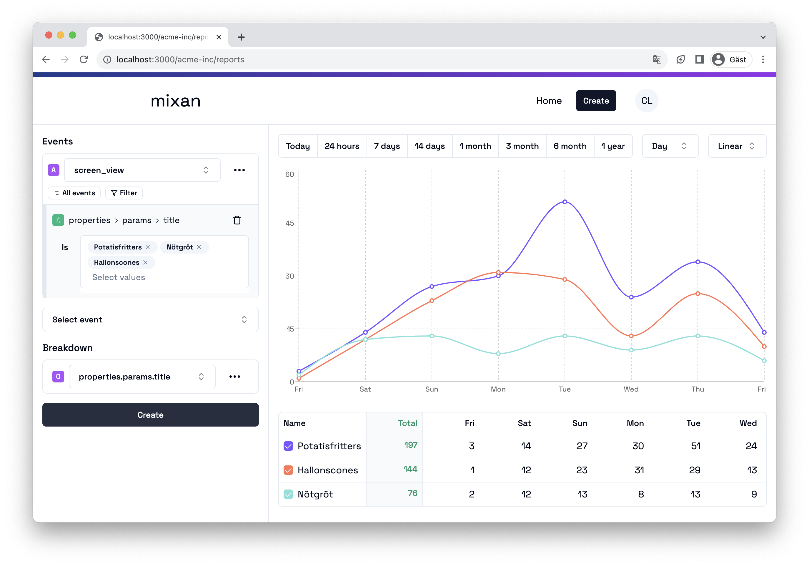
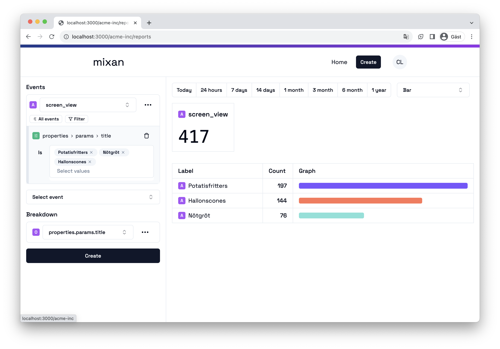
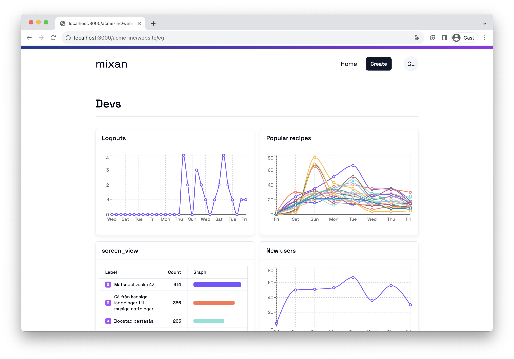
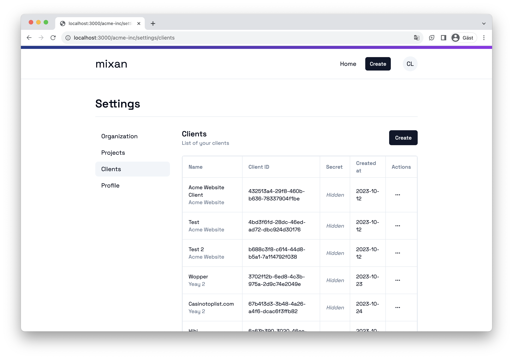

<p align="center">
  
</p>

# mixan

Mixan is a simple analytics tool for logging events on web and react-native. My goal is to make a minimal mixpanel copy with the most basic features (for now).

## Whats left?

> Currently storing events on postgres but will probably move it to [clickhouse](https://clickhouse.com/) to speed up queries. Don't have any performance issues yet so will wait and see how well postgres can handle it.

### GUI

* [ ] Rename event label
* [ ] Real time data (mostly screen_views stats)
  * [ ] Active users (5min, 10min, 30min)
* [X] Save report to a specific dashboard
* [ ] View events in a list
* [ ] View profiles in a list
* [ ] Invite users
* [ ] Drag n Drop reports on dashboard
* [ ] Manage dashboards
* [ ] Support more chart types
  * [X] Bar
  * [ ] Pie
  * [ ] Area
* [ ] Support funnels
* [ ] Support multiple breakdowns
* [ ] Aggregations (sum, average...)

### SDK

* [ ] Store duration on screen view events (can be done in backend as well)
* [ ] Create native sdk 
  * [ ] Handle sessions
* [ ] Create web sdk
  * [ ] Screen view function should take in title, path and parse query string (especially utm tags)

## @mixan/sdk

For pushing events

### Install

- npm: `npm install @mixan/sdk`
- pnpm: `pnpm add @mixan/sdk`
- yarn: `yarn add @mixan/sdk`

### Usage

```ts
import { Mixan } from '@mixan/sdk';

const mixan = new Mixan({
  clientId: 'uuid',
  clientSecret: 'uuid',
  url: 'http://localhost:8080/api/sdk',
  batchInterval: 10000,
  verbose: false,
  saveProfileId(id) {
    // Web
    localStorage.setItem('@profileId', id)
    // // react-native-mmkv
    // mmkv.setItem('@profileId', id)
  },
  removeProfileId() {
    // Web
    localStorage.removeItem('@profileId')
    // // react-native-mmkv
    // mmkv.delete('@profileId')
  },
  getProfileId() {
    // Web
    return localStorage.getItem('@profileId')
    // // react-native-mmkv
    // return mmkv.getString('@profileId')
  },
})

mixan.setUser({
  id: 'id',
  first_name: 'John',
  last_name: 'Doe',
  email: 'john.doe@gmail.com',
  properties: {} // any properties
})

// will upsert 'app_open' on user property and increment it
mixan.increment('app_open') 
// will upsert 'app_open' on user property and increment it by 10
mixan.increment('app_open', 10)
// will upsert 'app_open' on user property and decrement it by 2 
mixan.decrement('app_open', 2) 

// send a sign_in event 
mixan.event('sign_in')

// send a sign_in event with properties 
mixan.event('sign_in', {
  provider: 'gmail'
})

// short hand for 'screen_view', can also take any properties
mixan.screenView('Profile', {
  id: '123',
  // any other properties, url, public
})
```

## @mixan/backend

Self hosted service for collecting all events. Dockerfile and GUI will be added soon.

## Screenshots




