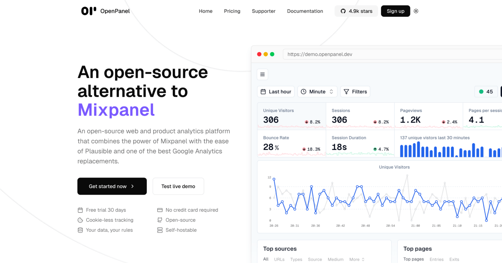

<p align="center">
	<h1 align="center"><b>Openpanel</b></h1>
<p align="center">
    An open-source alternative to Mixpanel
    <br />
    <br />
    <a href="https://openpanel.dev">Website</a>
    ·
    <a href="https://openpanel.dev/docs">Docs</a>
    ·
    <a href="https://dashboard.openpanel.dev">Sign in</a>
    ·
    <a href="https://go.openpanel.dev/discord">Discord</a>
    ·
    <a href="https://twitter.com/OpenPanelDev">X/Twitter</a>
    ·
    <a href="https://twitter.com/CarlLindesvard">Creator</a>
    ·
  </p>
  <br />
  <br />
</p>
  
Openpanel is an open-source web and product analytics platform that combines the power of Mixpanel with the ease of Plausible and one of the best Google Analytics replacements.

## ✨ Features

- **🔍 Advanced Analytics**: Funnels, cohorts, user profiles, and session history
- **🎬 Session Replay**: Record and replay user sessions with privacy controls built in
- **📊 Real-time Dashboards**: Live data updates and interactive charts
- **🎯 A/B Testing**: Built-in variant testing with detailed breakdowns
- **🔔 Smart Notifications**: Event and funnel-based alerts
- **🌍 Privacy-First**: Cookieless tracking and GDPR compliance
- **🚀 Developer-Friendly**: Comprehensive SDKs and API access
- **📦 Self-Hosted**: Full control over your data and infrastructure
- **💸 Transparent Pricing**: No hidden costs or usage limits
- **🛠️ Custom Dashboards**: Flexible chart creation and data visualization
- **📱 Multi-Platform**: Web, mobile (iOS/Android), and server-side tracking
- **🤖 MCP Server**: Ask Claude, Cursor, or any MCP client about your users — 38 tools, hosted, no install
- **💰 Revenue Tracking**: Monitor purchases, subscriptions, and LTV alongside product events
- **🔌 Integrations**: Connect Google Search Console, and more to enrich your data

## 📊 Analytics Platform Comparison

| Feature                                | OpenPanel | Mixpanel | GA4       | Plausible |
|----------------------------------------|-----------|----------|-----------|-----------|
| ✅ Open-source                         | ✅         | ❌        | ❌        | ✅         |
| 🧩 Self-hosting supported              | ✅         | ❌        | ❌        | ✅         |
| 🔒 Cookieless by default               | ✅         | ❌        | ❌        | ✅         |
| 🔁 Real-time dashboards                | ✅         | ✅        | ❌        | ✅         |
| 🔍 Funnels & cohort analysis           | ✅         | ✅        | ✅*       | ✅***         |
| 👤 User profiles & session history     | ✅         | ✅        | ❌        | ❌         |
| 🎬 Session replay                      | ✅         | ✅****    | ❌        | ❌         |
| 📈 Custom dashboards & charts          | ✅         | ✅        | ✅        | ❌         |
| 💬 Event & funnel notifications        | ✅         | ✅        | ❌        | ❌         |
| 🌍 GDPR-compliant tracking             | ✅         | ✅        | ❌**      | ✅         |
| 📦 SDKs (Web, Swift, Kotlin, ReactNative) | ✅      | ✅        | ✅        | ❌         |
| 💸 Transparent pricing                 | ✅         | ❌        | ✅*       | ✅         |
| 🚀 Built for developers                | ✅         | ✅        | ❌        | ✅         |
| 🔧 A/B testing & variant breakdowns    | ✅         | ✅        | ❌        | ❌         |

> ✅* GA4 has a free tier but often requires BigQuery (paid) for raw data access.
> ❌** GA4 has faced GDPR bans in several EU countries due to data transfers to US-based servers.
> ✅*** Plausible has simple goals
> ✅**** Mixpanel session replay is limited to 5k sessions/month on free and 20k on paid. OpenPanel has no limit.

## Stack

- **Nextjs** - the dashboard
- **Fastify** - event api
- **Postgres** - storing basic information
- **Clickhouse** - storing events
- **Redis** - cache layer, pub/sub and queue
- **BullMQ** - queue
- **GroupMQ** - for grouped queue
- **Resend** - email
- **Arctic** - oauth
- **Oslo** - auth
- **tRPC** - api
- **Tailwind** - styling
- **Shadcn** - ui

## Self-hosting

OpenPanel can be self-hosted and we have tried to make it as simple as possible.

You can find the how to [here](https://openpanel.dev/docs/self-hosting/self-hosting)

**Give us a star if you like it!**

[](https://star-history.com/#Openpanel-dev/openpanel&Date)

## Development

### Prerequisites

- Docker
- Docker Compose
- Node
- pnpm

### Start

```bash
pnpm install
cp .env.example .env
echo "API_URL=http://localhost:3333" > apps/start/.env

pnpm dock:up
pnpm codegen
pnpm migrate:deploy # once to setup the db
pnpm dev
```

You can now access the following:

- Dashboard: https://localhost:3000
- API: https://api.localhost:3333
- Bullboard (queue): http://localhost:9999
- `pnpm dock:ch` to access clickhouse terminal
- `pnpm dock:redis` to access redis terminal
